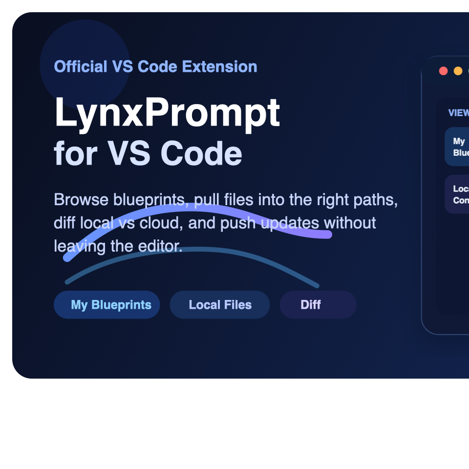

<p align="center">
  
</p>

<h1 align="center">LynxPrompt for VS Code</h1>

<p align="center">
  Browse, pull, diff, and push AI config files directly from VS Code.
</p>

<p align="center">
  <a href="https://marketplace.visualstudio.com/items?itemName=LynxPrompt.lynxprompt"></a>
  <a href="https://marketplace.visualstudio.com/items?itemName=LynxPrompt.lynxprompt"></a>
  <a href="https://marketplace.visualstudio.com/items?itemName=LynxPrompt.lynxprompt"></a>
  <a href="https://github.com/GeiserX/lynxprompt-vscode/blob/main/LICENSE"></a>
</p>

<p align="center">
  <a href="https://marketplace.visualstudio.com/items?itemName=LynxPrompt.lynxprompt"><strong>Install from VS Code Marketplace</strong></a>
  ·
  <a href="vscode:extension/LynxPrompt.lynxprompt"><strong>Open in VS Code</strong></a>
  ·
  <a href="https://github.com/GeiserX/lynxprompt-vscode"><strong>Source Code</strong></a>
</p>

LynxPrompt helps you create, sync, and manage AI IDE configuration files for Claude, Cursor, GitHub Copilot, Windsurf, and many more tools from a single place. This extension brings that workflow directly into the editor, so you can manage cloud blueprints and local config files without context-switching to the browser.

## Install

Install from the [VS Code Marketplace](https://marketplace.visualstudio.com/items?itemName=LynxPrompt.lynxprompt) or run:

```bash
ext install LynxPrompt.lynxprompt
```

## What You Can Do

### Browse Blueprints and Local Files

Use the dedicated sidebar to see your LynxPrompt blueprints and the AI config files detected in the current workspace.

- **My Blueprints** shows cloud blueprints grouped by type
- **Local Config Files** shows workspace files with sync status indicators

### Sign In with Device Flow

Authenticate securely without copying tokens by hand.

1. Run **LynxPrompt: Sign In**
2. Complete authentication in your browser
3. Return to VS Code and start browsing your blueprints

### Pull Blueprints into the Right Paths

Download a blueprint and let the extension place it in the correct workspace location automatically.

- `CLAUDE.md`
- `AGENTS.md`
- `.cursor/rules/`
- `.github/copilot-instructions.md`
- `.windsurfrules`

### Push Local Configs Back to LynxPrompt

Right-click a supported file or use the command palette to upload local configs as blueprints.

### Diff Local vs Cloud

Open the built-in VS Code diff editor to compare a local file with its linked cloud blueprint before deciding what to keep.

### Generate and Convert

Open the LynxPrompt wizard in your browser to generate new configs, or convert supported config formats locally.

### Watch for Drift

The extension monitors linked config files and notifies you when local files diverge from the cloud version.

## Requirements

- VS Code `1.85.0` or later
- A LynxPrompt account at [lynxprompt.com](https://lynxprompt.com)

## Commands

| Command | Description |
|---------|-------------|
| `LynxPrompt: Sign In` | Authenticate with LynxPrompt using device flow |
| `LynxPrompt: Sign Out` | Clear stored credentials |
| `LynxPrompt: Refresh Blueprints` | Reload blueprint list from the cloud |
| `LynxPrompt: Refresh Local Files` | Rescan the workspace for AI config files |
| `LynxPrompt: Pull Blueprint to Workspace` | Download a blueprint to the correct file path |
| `LynxPrompt: Push to LynxPrompt` | Upload a local config file as a blueprint |
| `LynxPrompt: Compare with Cloud` | Open the diff editor for local vs cloud |
| `LynxPrompt: Generate Config` | Open the LynxPrompt wizard in your browser |
| `LynxPrompt: Convert Format` | Convert between supported AI config formats |

## Extension Settings

| Setting | Default | Description |
|---------|---------|-------------|
| `lynxprompt.apiUrl` | `https://lynxprompt.com` | Base URL for the LynxPrompt API. |
| `lynxprompt.autoDetectConfigFiles` | `true` | Automatically detect AI configuration files in the workspace. |
| `lynxprompt.watchFileChanges` | `true` | Watch linked files and notify on divergence from cloud. |
| `lynxprompt.showStatusBar` | `true` | Show connection status in the status bar. |

## Development

```bash
npm install
npm run watch
npm run build
npm run package
```

Press `F5` in VS Code to launch the Extension Development Host.

## Contributing

Contributions are welcome. Open an issue first to discuss substantial changes.

## License

[GPL-3.0](LICENSE)
